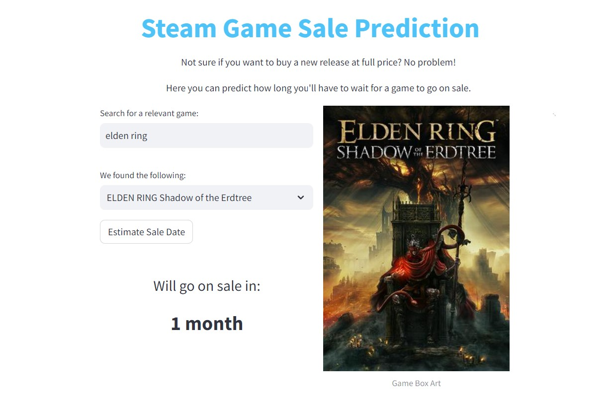
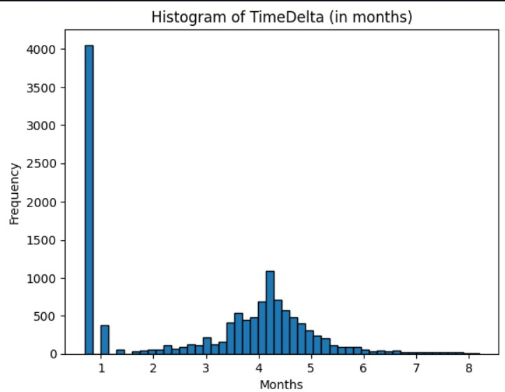

# Steam Sale Sensei

This project is a Streamlit application that predicts how long a game will take to go on sale after its release, utilizing data from the Steam API and IsThereAnyDeal API. The prediction model is based on two XGBoost algorithms trained on historical game data.

[Try it on a new release game now!](http://54.163.212.0:8501)

## Project Overview

### Data Collection

The data collection process involves retrieving information from two main sources: Steam API - used to gather basic information about games, including release dates, mac/linux availibilty, supported languages, etc., and the IsThereAnyDeal API - provoding historical data on game prices and discounts across various platforms, which we filtered for Steam games only. To query a list of games and get the relevant data for each, we used games from select years taken from this Kaggle dataset: https://www.kaggle.com/datasets/fronkongames/steam-games-dataset.

Games sales likely could have been affected by lockdowns and pandemic, so data was only taken from games released in the years 2014-2017. Note: to get the full relevant dataset, we have to make requests for the list of games for these years, which takes over 10 hours, so they were done seperately. All data is store in an S3 bucket. 

### EDA and Feature Engineering

Features used for predictions in the final model were: Achievements, Supported Languages, Mac, Linux, Month, Categories, and Tags.

 - Achievements, Mac, and Linux were all binary columns, so they remained unchanged. Other binary columns in the dataset were present but they had no predictive power (were either always 1 or 0).
 - Month was taken from the release date, as the time of year can greatly affect how soon a game, or any item for that matter, will go on sale.
 - Categories and Tags were both multi-label columns and so were one-hot encoded with a multi label binarizer.
 - Supported Languages was taken down to the number of Supported Languages instead, for simplicity. In retrospect, this might have been better handled with a multi label binarizer, and perhaps can be modified for the next version.

### Modeling

The core of the project involves building two predictive models using XGBoost, trying to predict how many months until a game goes on sale. As you can see below, the distribution of the target variable has a normally distributed form (after doing a log transform), but still with most values being detached from it.

After some exploration, it seems the large bar on the left is made up of primarily games that went on sale in the first day of release, and some more on the second day. Due to this, two models were built, one binary classifier to predict if a game went on sale within 2 days, and if not then another model to predict how many months until it would go on sale (only considering games from the normal distribution).

### Deployment

Preprocessing and modeling were modularized into seperate scripts to deploy into sagemaker. This is for future reference as project expands. Aside from this, a streamlit app was deployed using an EC2 instance. Users can input queries to search for games based on title keywords. Then using the Steam API we fetch relevant games and allows users to select a game of interest. Upon selection, the prediction is displayed alongside it's box art.

### Usage
Python 3.10
See requirements.txt file in streamlit_app folder

### Acknowledgments
 - Steam API: Data sourced from the Steam platform.
 - IsThereAnyDeal API: Data sourced from the IsThereAnyDeal platform.
 - Kaggle Dataset: https://www.kaggle.com/datasets/fronkongames/steam-games-dataset